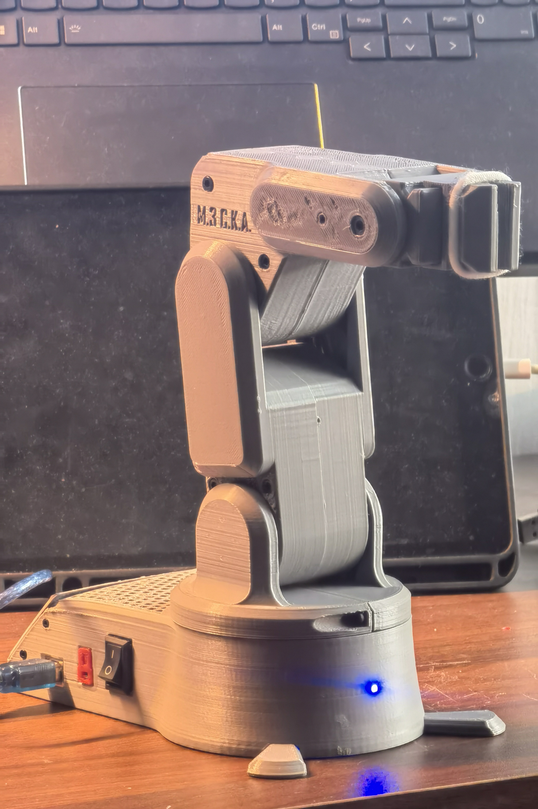
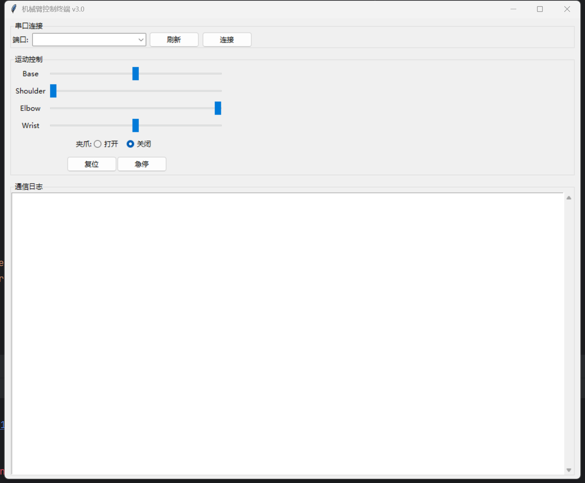

# Tse-M3DKA
> **我的机械臂**
>
>  视频介绍：[复刻开源机械臂](https://www.bilibili.com/video/BV1GM4m1R7kN/)
> 
>  视频介绍：[打印中](https://v.douyin.com/iyWBaaXT/)
> 
>  视频介绍：[是谁敲了一晚上的代码呀。是我呀累(ノへ`、)](https://v.douyin.com/iyWBVt3w/)
>
>  视频介绍：[上位程序搞定](https://v.douyin.com/aAHZoPsLHYs/)

> **感谢以下项目作者：**
>
> * [How to Build a 3D Printed Robot Arm Tutorial (Arduino Based)](https://youtube.com/watch?v=AIsVlgopqJc&si=mFCGv56T8LsnVQlr)
